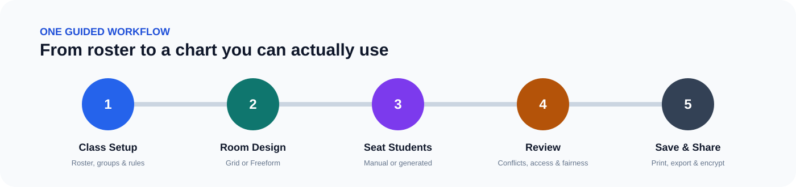

<div align="center">
  

# Classroom Seating Planner

**Build better seating charts around the students, rules, room, and lesson you actually have.**

A free, open-source, privacy-conscious seating planner for educators. Design the room, add student needs and seating rules, choose a classroom objective, build or generate plans, review conflicts, and share only what each audience should see.

[**Launch the hosted app**](https://nomadcf.github.io/seatingchart/) · [Privacy](PRIVACY.md) · [Security](SECURITY.md) · [Data handling](DATA-HANDLING.md) · [Changelog](CHANGELOG.md)


</div>

---

## Seating charts are easy until students have actual needs

A classroom rarely fits into a perfect grid, and students rarely come with no constraints.

Classroom Seating Planner is built for the messy version of the problem: students who need the front, students who should be separated, groups that should stay together or spread out, accessible seating, room zones, fixed objects, temporary absences, substitute-friendly charts, and plans that should not repeat the same placements forever.

The app combines **room design**, **student rules**, **manual placement**, **automatic plan generation**, **Classroom Intelligence**, **conflict review**, **history and fairness analysis**, and **privacy-controlled sharing** in one workflow.

### V7.2.3 current production release

V7.2.3 is the active hosted and portable production baseline. It keeps the stable V7.2 seating, room, planning, security, Drive/Classroom, Planner Packs, Testing Mode, Activity Layouts, Station Rotations, Classroom Intelligence, and Guided Help features while cleaning stale release references, obsolete maintenance notes, and outdated regression assertions.

### V7.2.0 Planner Packs

Package reusable classroom-planning knowledge without packaging the class itself. Planner Packs are portable JSON files that can contain room templates, student-need presets, custom room-object definitions, Activity Layouts, Station Rotation blueprints, and Testing Mode defaults. Build a pack from the current planner, install shared packs into a browser-local library, preview exactly what will be added, and apply only selected component types.

V7.2 is deliberately privacy-guarded: generated packs strip seat assignments, roster/student IDs, private/substitute/public notes, student-to-zone links, and student-specific distance relationships. Floor-plan images are excluded by default and require explicit opt-in. Imported files declaring or carrying meaningful structured student data are refused. Pack names, descriptions, labels, and station instructions remain free text, so teachers should review that text before sharing. Packs work offline, require no account or server, and can be shared through Drive, email, GitHub, a district repository, or any normal file channel.


### V7.0.3 Testing Mode

Generate a non-destructive testing-room preview from the current Freeform classroom, maximize practical center-to-center student spacing, preserve locked seat positions and existing student assignments, respect configured accessibility/front/aisle needs, and explain when the requested separation cannot physically fit around the current roster and fixed room objects. Applying the preview creates a separate Activity Layout and keeps the original arrangement available for the return transition. Testing Mode also provides an ordered physical move list and uses feet/meters when the Classroom Digital Twin is scaled.

### V7.0.2 Station Rotations

Build lesson rotations directly on the Classroom Digital Twin without changing the seating chart. Rotation plans can use existing Activity Stations, Lab Stations, or tables as destinations; create size-balanced teams from the active roster or seed teams from classroom groups; exclude Today Mode absences when rebuilding; link a rotation to the Activity Layout it was designed for; run per-station and transition timers; move forward or backward through explicit rounds; and show each station's current team directly on the Freeform room. Rotation plans never silently reseat students and the balancing option uses roster order and team size only, not hidden behavior scoring.

### V7.0.1 Activity Layouts

A single Freeform classroom can now keep multiple named teaching arrangements while sharing the same physical room dimensions, floor-plan background, and fixed room features. Create Direct Instruction, Group Work, Discussion Circle, Lab / Stations, Independent Work, or Testing starters; fine-tune each arrangement with the normal Freeform tools; switch layouts without intentionally changing matching student assignments; duplicate and rename arrangements; and compare two layouts side by side before moving furniture.

### V7.0 Classroom Digital Twin foundation

Freeform rooms can now carry real physical dimensions without invalidating older layouts. Turn on a scaled grid and rulers, show physical measurements on room objects, measure distances between two objects, add fixed furniture such as shelves, cabinets, lab stations, sinks, and activity stations, and place a classroom photo or floor plan underneath the existing layout as a locked reference layer. The floor-plan image is optimized in the browser before it is stored with the class, and inclusion in printed charts is explicit.

### V6.8.1 grouped seating refinement

Freeform tables and pods now read as intentional groups across Room Design, Seat Students, Presentation mode, print, copied chart images, and Freeform plan comparisons. The refinement uses subtle pod boundaries, clearer table surfaces, deliberate open-seat styling, compact state cues, and the existing group colors without changing the saved seating model.

### What makes it different

| Design the real room | Seat with intent | Share with control |
| --- | --- | --- |
| Grid or Freeform layouts | Together, avoid, spread, anchor, front/back, zone, accessibility, and distance rules | Teacher, substitute, student-facing, support-team, anonymous, and room-only views |
| Tables, doors, walls, boards, projectors, walkways, ADA spaces, custom objects, and more | Manual placement, automatic plan generation, and scenario-based Classroom Intelligence | Select exactly which names, fields, groups, zones, and note categories are included |
| Rotate, resize, align, group, lock, layer, and audit objects | Live valid-seat guidance, plan-health checks, smallest-change repair previews, and conflict-resolution tools | Encrypted saves, local backups, Google Drive storage, printable output, CSV, image, PDF/SVG-oriented export paths |

---

## Try it

### Hosted / installable PWA

**[Open Classroom Seating Planner](https://nomadcf.github.io/seatingchart/)**

The hosted version can be used in the browser and supports installable PWA/offline behavior.

### Portable single-file version

The distributed application is also available as a self-contained HTML file. The deployed [`index.html`](index.html) can be saved and opened locally in a modern browser for a portable, server-free workflow.

Core local use does not require a subscription or a continuously running application server.

---

## A five-stage classroom workflow

<p align="center">
  
</p>

1. **Class Setup** - Create classes, import or enter students, organize groups, add notes, and define seating requirements.
2. **Room Design** - Build a Standard Grid or detailed Freeform representation of the classroom.
3. **Seat Students** - Place students manually, ask the planner to generate candidates, inspect valid seats, use Classroom Intelligence, and resolve conflicts.
4. **Review** - Check unassigned students, rule violations, accessibility, group outcomes, layout problems, history, and fairness.
5. **Save & Share** - Save securely, create backups, print audience-specific charts, export data, or create purpose-limited read-only packages.

The workflow is intentionally guided, but teachers can still move between stages as the classroom changes.

---

## Built for real classroom constraints

### Intelligent seating rules

Define requirements such as:

- keep two students together or apart
- spread members of a group across the room
- anchor a student to a specific seat or area
- prefer the front or back of the classroom
- require an accessible seat or route
- require or avoid a classroom zone
- keep a student near or away from a room object
- preserve intentional locked placements
- apply requirements to multiple students in bulk

The planner can surface valid seats for an individual student, generate multiple seating candidates, explain why plans differ, and identify requirements that make a plan impossible or problematic.

### Classroom Intelligence without a black box

V6.8 adds a planning layer that works with the explicit rules teachers already configured instead of silently inventing new ones.

Choose the objective that matches the lesson:

- **Balanced Classroom** - balance requirements, preferences, stability, and rotation
- **Minimal Movement** - repair problems while moving as few students as possible
- **Fair Rotation** - favor fresh placements for students who have repeatedly occupied the same locations
- **Accessibility First** - prioritize required student needs before softer preferences
- **Quiet Testing** - emphasize separation, stability, and the smallest safe repair
- **Collaborative Lesson** - favor configured together/group relationships while preserving required constraints

Classroom Intelligence shows a plan-health summary, calls out concrete capacity or rule blockers, and can preview the smallest useful repair. The preview lists exactly which students would move and where they would move before anything is applied. Teachers remain in control, normal undo/autosave protections still apply, and the engine does not use an external AI service, hidden behavioral scores, or automatic rule rewriting.

### Room design beyond rows and columns

Use **Standard Grid** for fast traditional charts or **Freeform** for rooms that contain pods, irregular tables, furniture, walking paths, teaching stations, ADA spaces, and other real-world geometry.

Freeform tools include object movement, resize, clockwise/counter-clockwise rotation, alignment, grouping, layering, locking, magnetic guides, minimap navigation, layout presets, collision/overlap checks, print boundaries, history, and room-integrity audits.

### Plans that can change without losing the past

- Save and name multiple seating plans
- Schedule plans for future use
- Compare two plans visually
- Restore earlier plans or snapshots
- Track seating history and repeated placements
- Review movement and fairness over time
- Use Today Mode for absences, temporary guests, and short-term classroom changes
- Use Classroom Intelligence to recheck or repair a changed day while preserving as much of the existing chart as practical

---

## Privacy is part of the product, not an afterthought

Classroom Seating Planner is designed so classroom information can remain local unless the user deliberately saves, exports, prints, shares, or connects an external service.

| Area | Approach |
| --- | --- |
| **Local storage** | Browser saving, autosave, snapshots, backups, restore points, and recovery tools |
| **Encryption** | Encrypted planner saving, password rotation, recovery workflows, and secure reset tools |
| **Google Drive** | Optional encrypted file storage with revision/change checks and conflict handling |
| **Google Classroom** | Optional read-only roster retrieval and reconciliation before applying changes |
| **Sharing** | Purpose-limited read-only HTML packages containing only selected information |
| **Printing** | Choose the fields, groups, zones, and note categories appropriate for the audience |
| **Support** | Sanitized diagnostic bundles are designed to omit student records, notes, passwords, encryption keys, OAuth tokens, and raw planner payloads |
| **Presentation** | Eye/Presentation Mode provides a view-focused workspace that reduces accidental editing or exposure of workflow controls |
| **Classroom Intelligence** | Runs locally against teacher-defined rules; proposed repairs are shown before application and do not require an external AI service |

Read the public [Privacy](PRIVACY.md), [Security](SECURITY.md), and [Data Handling](DATA-HANDLING.md) documents before using the application with sensitive classroom information.

> **Do not place classroom rosters, student notes, credentials, encryption keys, or raw planner data in public GitHub issues.** Use sanitized diagnostics whenever possible.

---

## Feature highlights

<details>
<summary><strong>Classes, students, groups, and rosters</strong></summary>

- Multiple classes, archived rosters, class copies, term rollovers, comparison, and merge workflows
- CSV import and export
- Optional Google Classroom roster retrieval and reconciliation
- Duplicate and near-match detection assistance
- Names, IDs, grades, nicknames, attendance information, requirements, and categorized notes
- Instructional/behavior groups, classroom zones, reserved locations, and related planning relationships
- Bulk requirement management and advanced roster/search filters

</details>

<details>
<summary><strong>Seating and planning</strong></summary>

- Drag, swap, move, clear, lock, and keyboard placement
- Live seat-validity guidance and valid-seat discovery
- Automatic multi-candidate seating-plan generation
- Explainable candidate differences and requirement outcomes
- Six Classroom Intelligence planning objectives for balanced, stable, rotational, accessibility-first, testing, and collaborative use
- Plan-health summaries for required conflicts, preference warnings, active unseated students, and seat capacity
- Concrete impossible-plan explanations for shortages, blocking rules, and students with no currently usable seat
- Smallest-change repair previews that show exact student moves before teacher approval
- Conflict-resolution actions and preflight conflict inspection
- Named and scheduled seating plans
- Seating history, movement, and fairness analysis
- Visual plan comparison
- Seat, zone, and plan comments
- Today Mode for attendance and temporary classroom changes

</details>

<details>
<summary><strong>Room design</strong></summary>

- Standard Grid and advanced Freeform modes
- Seats, teacher areas, tables, doors, walls, windows, boards, projectors, walkways, carpets, ADA spaces, and custom objects
- Move, resize, rotate, align, group, layer, lock, and arrange Freeform objects
- Magnetic alignment guides, minimap, presets, object history, collision handling, overlap detection, print boundaries, and integrity audits
- Printable blank room layouts

</details>

<details>
<summary><strong>Save, recovery, export, and sharing</strong></summary>

- Encrypted browser autosave and downloaded backups
- Linked working files, password rotation, startup recovery, and recovery packages
- Undo/redo, automatic/manual snapshots, selective restore, and restore points
- Save-health monitoring, interrupted-write protection, multi-tab detection, and conflict options
- Optional Google Drive file management, revisions, reconnect status, duplicate handling, and remote-change detection
- Three-way merge support for Drive-based collaboration checks while the application is open
- CSV export of assignments and rule/violation information
- Copy chart as image plus PDF/SVG-oriented output paths
- Print-as-seen, names-only, substitute, detailed, and blank-room outputs
- Sanitized support bundles
- Purpose-limited read-only encrypted sharing packages
- Reusable room and planning template libraries

</details>

<details>
<summary><strong>Accessibility and interface</strong></summary>

- Desktop, tablet, mobile, and touch workflows
- Keyboard navigation and alternatives to drag-only interactions
- Focus-managed dialogs and screen-reader announcements
- Reduced-motion support
- Responsive/reflow-oriented layouts, collapsible panels, and focus mode
- Adjustable display preferences, themes, seat text sizing, workspace zoom, shortcuts, and localization infrastructure
- Quick Start, searchable reference help, guided lessons, practice classes, contextual Guide Me tools, diagnostics, and troubleshooting

</details>

---

## Collaboration without pretending a shared file is Google Docs

Classroom Seating Planner can use a shared Google Drive file for teacher-to-teacher workflows without requiring a continuously running collaboration server.

While the app is open it can perform Drive change checks, detect remote revisions, surface editing/conflict notices, maintain a bounded collaboration activity ledger, and support three-way merge workflows.

This is **not** represented as realtime Google-Docs-style collaboration. Immediate synchronized seat movement between users would require a continuously running coordination service, which this project deliberately does not require for its core deployment model.

---

## Google integration

Google integration is optional.

- **Google Drive:** save/load encrypted planner files, inspect revisions, reconnect, detect remote changes, and manage file conflicts.
- **Google Classroom:** read roster information and reconcile it before applying roster changes.
- **Google Picker:** optional native file-browser experience that additionally requires a restricted browser API key.

See [`docs/OAUTH_DEPLOYMENT.md`](docs/OAUTH_DEPLOYMENT.md) for the deployment distinction and recommended restrictions.

---

## For developers and contributors

The portable deliverable remains a single self-contained HTML application, but the maintainable source is modular.

- HTML shell: `src/index.template.html`
- Styles: `src/styles/`
- Ordered JavaScript modules: `src/scripts/` (37 modules in V7.2.3)
- Built portable file: `dist/Classroom-Seating-Planner.html`
- Deployed hosted entry point: `index.html`

### Development

```bash
npm install
npm run build
npm test
npm run test:browser
```

`npm run build` assembles the portable HTML from the committed modular source. Normal CI validates the deterministic V7.2.3 build, generated-file parity, schemas, and service-worker syntax in seconds. The complete Playwright desktop/mobile regression suite remains available through the scheduled/manual **Full browser regression** workflow and `npm run test:browser`.

### Public data contracts

Forward-compatible JSON Schema documents are included for third-party validation and tooling:

- [`schemas/planner-v13.schema.json`](schemas/planner-v13.schema.json) - decrypted `classroom-seating-planner-save-v6`, data schema 13
- [`schemas/envelope-v3.schema.json`](schemas/envelope-v3.schema.json) - encrypted `classroom-seating-planner-encrypted-envelope-v6`, envelope 3

Additive fields remain allowed so minor releases can evolve without forcing every external reader to update immediately.

---

## Documentation

| Document | Purpose |
| --- | --- |
| [`PRIVACY.md`](PRIVACY.md) | Public privacy model |
| [`SECURITY.md`](SECURITY.md) | Security expectations and reporting guidance |
| [`DATA-HANDLING.md`](DATA-HANDLING.md) | How classroom and diagnostic data are handled |
| [`CHANGELOG.md`](CHANGELOG.md) | Release history and notable changes |
| [`docs/OAUTH_DEPLOYMENT.md`](docs/OAUTH_DEPLOYMENT.md) | Google OAuth / Picker deployment guidance |
| [`docs/WCAG-2.2-AA-AUDIT.md`](docs/WCAG-2.2-AA-AUDIT.md) | WCAG 2.2 AA-oriented release audit checklist |

---

## Feedback and contributions

Bug reports, usability feedback, accessibility findings, documentation improvements, and pull requests are welcome.

- [Open an issue](https://github.com/NomadCF/seatingchart/issues)
- [View the source](https://github.com/NomadCF/seatingchart)
- [Launch the app](https://nomadcf.github.io/seatingchart/)

Please describe problems using sample or sanitized data. Never post real student records or other sensitive classroom information to a public issue.

---

## License

Classroom Seating Planner is released under the [MIT License](LICENSE).

Use it, study it, modify it, deploy it, and contribute improvements back if they are useful to others.